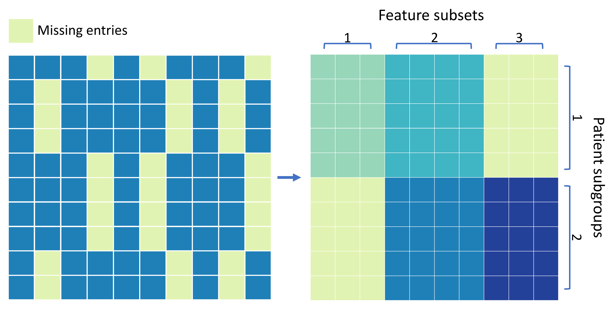
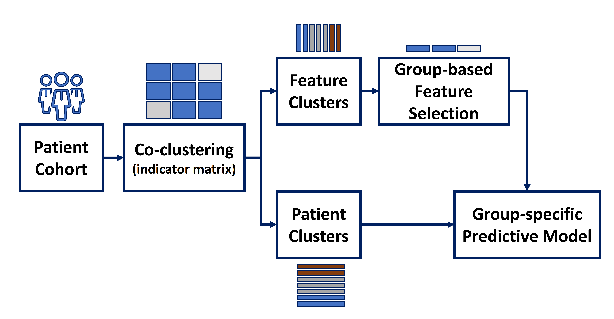
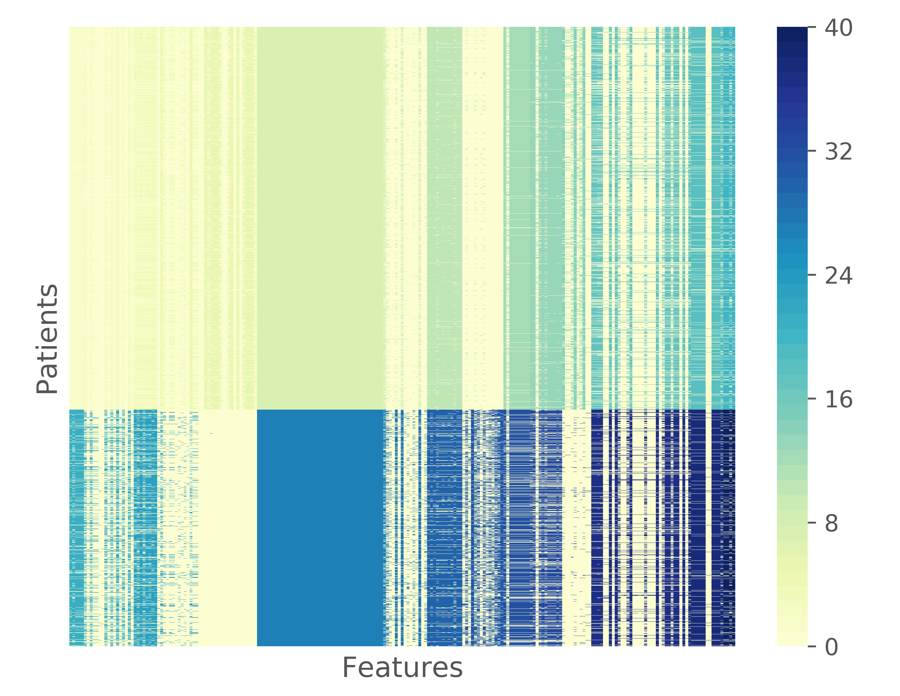
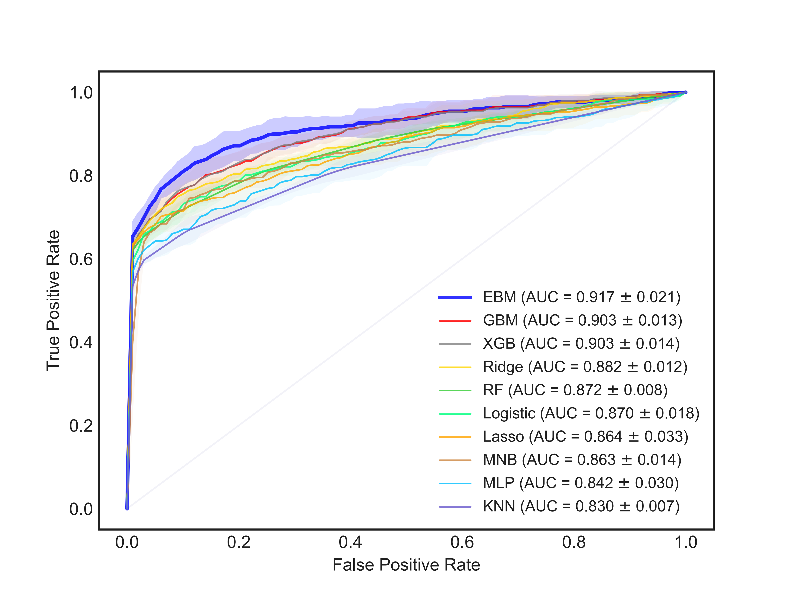

### Introduction

The goal of this notebook is to provide some technical details (key steps) for our paper: 

> *Haolin Wang, et al. "Integrating Co-clustering and Interpretable Machine Learning for the Prediction of Intravenous Immunoglobulin Resistance in Kawasaki Disease", IEEE ACCESS, 2020.* 

To enable clinically applicable prediction addressing the incompleteness of clinical data and the lack of interpretability of machine learning models, a multi-stage method is developed by integrating data missing pattern mining and intelligible models. First, co-clustering is adopted to characterize the block-wise data missing patterns by simultaneously grouping the clinical features and patients to enable (a) group-based feature selection and missing data imputation and (b) patient subgroup-specific predictive models considering the availability of data. Second, feature selection is performed using the group Lasso to uncover group-specific risk factors. Third, the Explainable Boosting Machine, which is an interpretable learning method based on generalized additive models, is applied for the prediction of each patient subgroup.




Fig 1. The block-wise missing patterns characterized by co-clustering.



Fig 2. The proposed multiple classifier system with static classifier selection based on co-clustering.

### Tools and Implementation

#### Packages

- Popular Python machine learning libraries such as scikit-learn and pandas

- imbalanced-learn: https://github.com/scikit-learn-contrib/imbalanced-learn

- InterpretML: https://github.com/interpretml/interpret

- Coclust: https://pypi.org/project/coclust/

- Group Lasso: https://github.com/AnchorBlues/GroupLasso/blob/master/grouplasso/model.py

#### Preprocessing

```
import pandas as pd

dat = pd.read_csv('dataset.csv')
df = pd.get_dummies(dat, columns=['categories'])
```

#### Over-sampling for imbalanced dataset

```
from imblearn.over_sampling import SMOTE

balanced_feature_set, balanced_label = SMOTE(sampling_strategy=<>, random_state=0).fit_resample(feature, label)
```

#### Missing data imputation to address data missing at random

```
from sklearn.experimental import enable_iterative_imputer
from sklearn.impute import IterativeImputer

imp = IterativeImputer(max_iter=5, random_state=0, tol=0.005)
feature_set = imp.fit_transform(feature_set)
```

#### Dataset splitting for cross-validation

```
from sklearn.model_selection import StratifiedKFold

skf = StratifiedKFold(n_splits=5)
skf.get_n_splits(X, y)
for train_index, test_index in skf.split(X, y):
    X_train, X_test = X[train_index], X[test_index]
    y_train, y_test = y[train_index], y[test_index]
```

#### Baseline methods

```
#Lasso
from sklearn.linear_model import Lasso
#Logistic
from sklearn.linear_model import LogisticRegression
#Ridge
from sklearn.linear_model import Ridge
#KNN
from sklearn import neighbors
model = neighbors.KNeighborsClassifier()
#Naive Bayes
from sklearn.naive_bayes import GaussianNB
#MLP
from sklearn.neural_network import MLPClassifier
#Random forest
from sklearn.ensemble import RandomForestClassifier
#lightGBM
import lightgbm 
#XGBoost
import xgboost as xgb
#EBM
from interpret.glassbox import ExplainableBoostingClassifier

#Those models are trained and tested using the same splitted dataset for cross-validation. The usage of lightGBM is slightly different.
train_data = lgb.Dataset(train_set, label=train_label)
param = {'metrics':'auc', 'objective': 'binary'}
model = lgb.train(param, train_data)
prob = model.predict(test_set)
```

#### Tuning the hyper-parameters

```
#alpha for Lasso
from sklearn.linear_model import Lasso
from sklearn.model_selection import GridSearchCV

params = {"alpha": numpy.logspace(-3, 1, 5)}
model_cv = GridSearchCV(Lasso(), params, cv=5)
model = model_cv.fit(train_set, train_label)
print("tuned hpyerparameters:", model.best_params_)
prob = model_cv.predict(test_set)
```

#### The AUC score of the five-fold cross-validation of the baseline methods

|          | 1     | 2     | 3     | 4     | 5     | MEAN  | STD   |
| -------- | ----- | ----- | ----- | ----- | ----- | ----- | ----- |
| Lasso    | 0.800 | 0.847 | 0.880 | 0.847 | 0.864 | 0.848 | 0.027 |
| Logistic | 0.802 | 0.847 | 0.888 | 0.856 | 0.874 | 0.853 | 0.029 |
| Ridge    | 0.811 | 0.865 | 0.897 | 0.849 | 0.876 | 0.860 | 0.029 |
| KNN      | 0.837 | 0.801 | 0.813 | 0.824 | 0.827 | 0.820 | 0.012 |
| MNB      | 0.855 | 0.866 | 0.867 | 0.826 | 0.830 | 0.849 | 0.017 |
| MLP      | 0.809 | 0.870 | 0.858 | 0.818 | 0.822 | 0.836 | 0.024 |
| RF       | 0.865 | 0.849 | 0.866 | 0.848 | 0.846 | 0.855 | 0.009 |
| EBM      | 0.882 | 0.875 | 0.878 | 0.869 | 0.888 | 0.878 | 0.006 |
| GBM      | 0.880 | 0.871 | 0.885 | 0.875 | 0.909 | 0.884 | 0.013 |
| XGB      | 0.884 | 0.876 | 0.886 | 0.866 | 0.900 | 0.882 | 0.011 |


### Co-clustering and Classification

#### Indicator matrix for incomplete dataset

```
# generate indicator matrix using the original dataset without missing data imputation
[rows, cols] = train_set_original.shape
train_ind = numpy.zeros((rows, cols))
for r in range(rows):
	for c in range(cols):
		if not numpy.isnan(train_set_original[r, c]):
			train_ind[r, c] = 1
train_rows_num = rows

...

# merge training set and test set splitted for cross-validation
full_ind = numpy.row_stack((train_ind, test_ind))
```

#### Co-clustering of the indicator matrix 

```
from coclust.coclustering import CoclustInfo

for row_cluster in range(2, 10):
	for column_cluster in range(2,30):
		...
        model = CoclustInfo(n_row_clusters=row_cluster,n_col_clusters=column_cluster, random_state=42)
        model.fit(full_ind)
        row_labels = model.row_labels_
        print(row_labels)
        col_labels = model.column_labels_
        print(col_labels)
        ...
```

#### Visualization

```
row_indices = numpy.argsort(model.row_labels_)
col_indices = numpy.argsort(model.column_labels_)
X_reorg = full_ind[row_indices, :]
X_reorg = X_reorg[:, col_indices]
cmap = sns.color_palette("YlGnBu", 41)
fig = sns.heatmap(X_reorg, cmap=cmap, xticklabels=False, yticklabels=False)
plt.savefig('co-cluster.tif', dpi=600, format='tif')
```



Fig 3. Co-clustering of the real-world clinical dataset

#### Re-organize samples for each row clusters to train multiple classifiers

```
for cluster_index in range(0, row_cluster):
	co_train_set = []
	co_train_label = []
	for k in range(0, train_rows_num):
		if row_labels[k] == cluster_index:
			co_train_label.append(train_label[k])
			co_train_set.append(train_set[k,:])
	co_train_set = numpy.array(co_train_set)
	co_train_label = numpy.array(co_train_label)
	print(co_train_set.shape)
	print(co_train_label.shape)
```

#### Feature selection with group feature structure

Group Lasso derives feature coefficients from certain groups to be small or exact zero. 

```
# train group lasso
from grouplasso import GroupLassoClassifier

model = GroupLassoClassifier(group_ids=numpy.array(col_labels),alpha=alpha_test, eta=0.001, tol=0.001, max_iter=3000, random_state=42, verbose_interval=300)
model.fit(co_train_set, co_train_label)
print(model.coef_)

# feature selection
selected_cols = []
for k in range(0, len(col_labels)):
	if abs(model.coef_[k]) > 0:
		selected_cols.append(k)
```

#### Train group-specific prediction model

```
decision_model = ExplainableBoostingClassifier().fit(co_train_set[:, selected_cols], co_train_label)
predict_test += list(decision_model.predict_proba(co_test_set[:, selected_cols])[:,1])
predict_test_label += list(co_test_label)
```

#### Evaluation metrics

```
from sklearn.metrics import precision_recall_fscore_support
from sklearn.metrics import average_precision_score

#for 5-fold cross-validation
for index in range(1, 6):
    best_f1 = 0
    keep_score = []
    test_label = np.load('xxx.npy')
    pred = np.load('xxx.npy')
    fpr, tpr, thresholds = metrics.roc_curve(test_label, prob)
    roc_auc = metrics.auc(fpr, tpr)
    print(roc_auc)

    for thres in pred:
        res_bin = []
        for p in prob:
            if p >= thres:
                res_bin.append(1)
            else:
                res_bin.append(0)

        score = precision_recall_fscore_support(test_label, res_bin, average='binary')
        print(score)
        if score[2] > best_f1:
            keep_score = score
            best_f1 = score[2]
    best_score.append(keep_score)
    average_pr.append(average_precision_score(test_label, prob, average='micro'))

print(best_score)
best_score_array = np.array(best_score)
average_pr = np.array(average_pr)

print( str(np.around(best_score_array[:,0].mean(), decimals=3)) + '+' + str(np.around(best_score_array[:,0].std(), decimals=3)))
print( str(np.around(best_score_array[:,1].mean(), decimals=3)) + '+' + str(np.around(best_score_array[:,1].std(), decimals=3)))
print( str(np.around(best_score_array[:,2].mean(), decimals=3)) + '+' + str(np.around(best_score_array[:,2].std(), decimals=3)))
print( str(np.around(average_pr.mean(), decimals=3)) + '+' + str(np.around(average_pr.std(), decimals=3)))
```

#### The AUC score of the five-fold cross-validation of the models enhanced by the proposed framework.

|          | 1         | 2         | 3         | 4         | 5         | MEAN      | STD   |
| -------- | --------- | --------- | --------- | --------- | --------- | --------- | ----- |
| Lasso    | 0.804     | 0.891     | 0.897     | 0.859     | 0.869     | 0.864     | 0.033 |
| Logistic | 0.835     | 0.887     | 0.875     | 0.878     | 0.874     | 0.87      | 0.018 |
| Ridge    | 0.873     | 0.894     | 0.896     | 0.884     | 0.864     | 0.882     | 0.012 |
| KNN      | 0.841     | 0.827     | 0.82      | 0.832     | 0.829     | 0.83      | 0.007 |
| MNB      | 0.84      | 0.883     | 0.858     | 0.861     | 0.872     | 0.863     | 0.014 |
| MLP      | 0.791     | 0.881     | 0.855     | 0.834     | 0.848     | 0.842     | 0.03  |
| RF       | 0.869     | 0.884     | 0.859     | 0.873     | 0.875     | 0.872     | 0.008 |
| GBM      | **0.888** | 0.892     | 0.925     | 0.908     | 0.9       | 0.903     | 0.013 |
| XGB      | **0.888** | 0.891     | 0.926     | 0.909     | 0.899     | 0.903     | 0.014 |
| EBM      | 0.88      | **0.919** | **0.946** | **0.916** | **0.923** | **0.917** | 0.021 |

#### ROC curve (mean+std)

```
import matplotlib.pyplot as plt
import numpy
from scipy import interp

plt.style.use('seaborn-white')

model_tprs = []
model_aucs = []
model_mean_fpr = []
model_mean_fpr = numpy.linspace(0, 1, 100)

model_fpr = numpy.load("../proposed/temp/model_" + str(group) + "_fpr.npy")
model_tpr = numpy.load("../proposed/temp/model_" + str(group) + "_tpr.npy")
model_auc = numpy.load("../proposed/temp/model_" + str(group) + "_auc.npy")
model_tprs.append(interp(model_mean_fpr, model_fpr, model_tpr))
model_tprs[-1][0] = 0.0
model_aucs.append(model_auc)

model_mean_tpr = numpy.mean(model_tprs, axis=0)
model_mean_tpr[-1] = 1.0
model_mean_auc = numpy.mean(model_aucs)
model_std_auc = numpy.std(model_aucs)
plt.plot(model_mean_fpr, model_mean_tpr, color='b',
         label=r'EBM (AUC = %0.3f $\pm$ %0.3f)' % (model_mean_auc, model_std_auc),
         lw=2, alpha=.8)
model_std_tpr = numpy.std(model_tprs, axis=0)
model_tprs_upper = numpy.minimum(model_mean_tpr + model_std_tpr, 1)
model_tprs_lower = numpy.maximum(model_mean_tpr - model_std_tpr, 0)
# label=r'$\pm$ 1 std. dev.'
plt.fill_between(model_mean_fpr, model_tprs_lower, model_tprs_upper, color='b', alpha=.2)
```



Fig 4. ROC curves

#### Interpretability

```
model = ExplainableBoostingClassifier()
model.fit(train_set, train_label)

ebm_global = model.explain_global()
# show(ebm_global)
# export model parameters
pd.DataFrame(ebm_global._internal_obj['overall']).to_csv('xxx.csv', index=False, header=False)

ebm_local = model.explain_local(train_set, train_label)
# export model parameters
pd.DataFrame(ebm_local._internal_obj['specific'][<sample_id>]['scores']).to_csv('xxx.csv', index=False, header=False)
```

